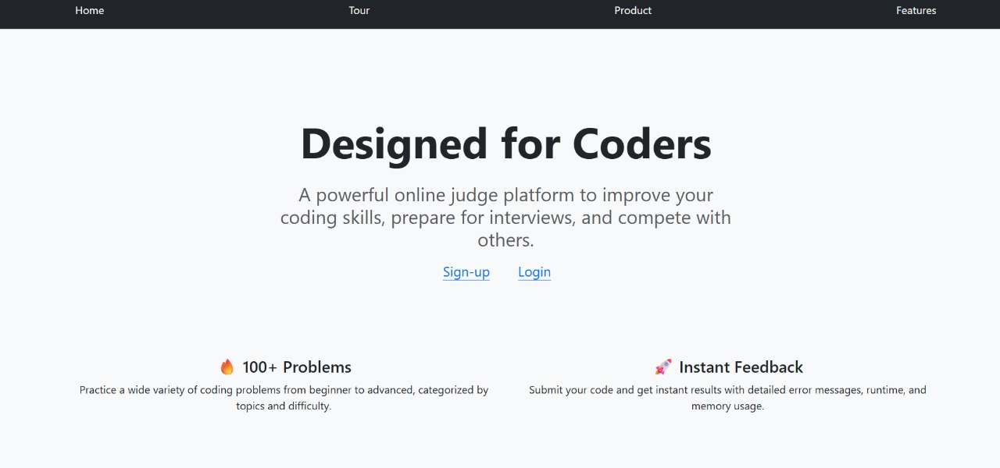
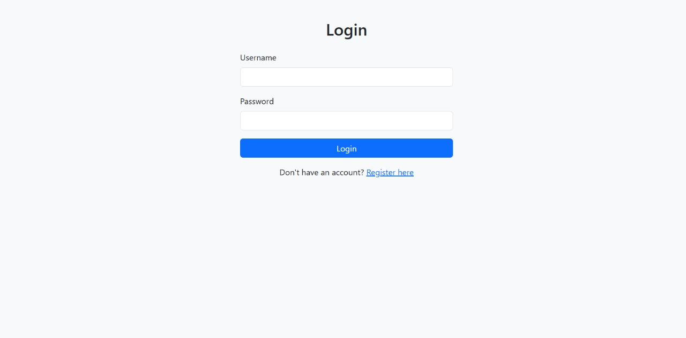
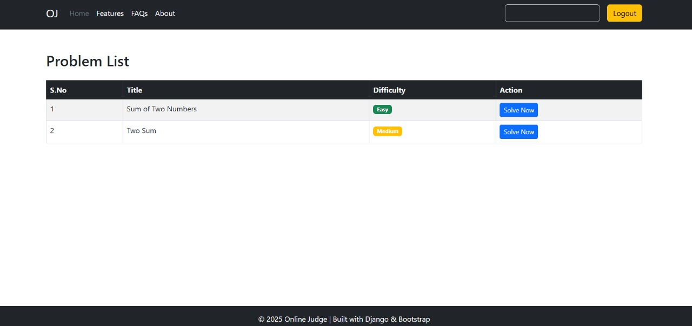
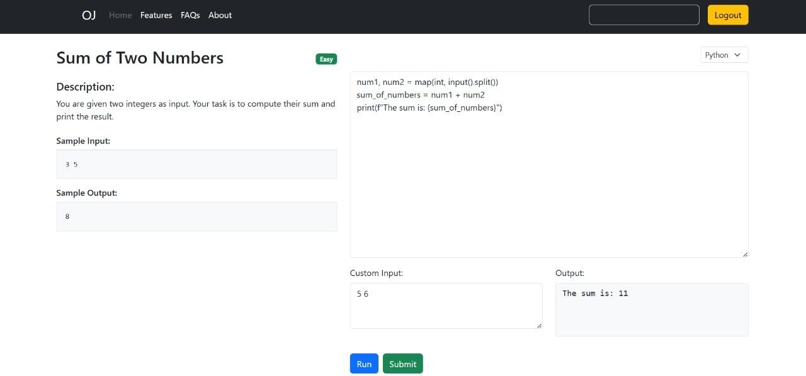
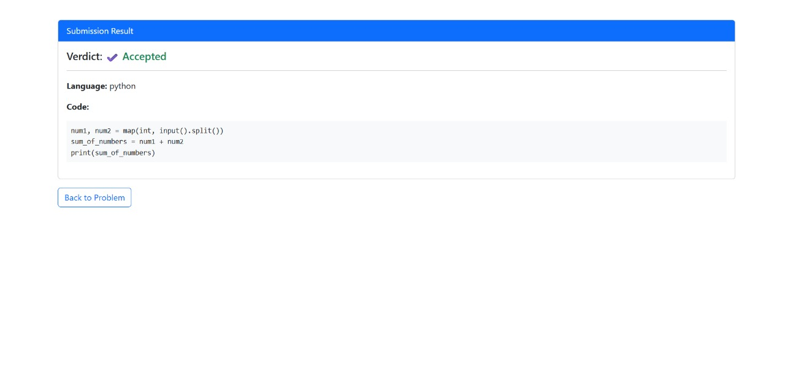

# 🧠 Online Code Practice Platform(Online Judge)

[](https://www.djangoproject.com/)
[](https://getbootstrap.com/)
[]
[](#license)

A **full-stack web application** for coding practice, built using Django, Bootstrap, SQLite, and JavaScript.  
This platform supports **user authentication**, **role-based access**, **problem listing**, and **code submission with live execution**.

---

## 🖼️ Demo Screenshots

### 🔐 Front Page



---

### 🔐 Login Page



---

### 📋 Problem List



---

### 💻 Code Editor with Custom Input



---

### 🔐 Submit Page



## 🚀 Features

<details>
  <summary><strong>🔐 User Authentication</strong></summary>

- Secure user registration and login system.
- Role-based redirection for:
  - 👨‍🎓 Normal users
  - ✍️ Problem setters
  - 🛠️ Admins

</details>

<details>
  <summary><strong>📋 Problem Listing</strong></summary>

- Displays a list of coding problems with:
  - Difficulty badges (Easy, Medium, Hard)
  - Tags and problem descriptions
  - Search and filter options

</details>

<details>
  <summary><strong>🧪 Code Submission</strong></summary>

- Live code editor with:
  - Language selection (e.g., Python, C++)
  - Custom input support
  - Hidden test case validation on submission
- Displays output and status (Pass/Fail)

</details>

<details>
  <summary><strong>🎨 Responsive UI</strong></summary>

- Built using Bootstrap for a clean, user-friendly interface
- Mobile-friendly and accessible layout
- Alerts, toasts, and interactive forms

</details>

---

## ⚙️ Tech Stack

| Layer        | Technology              |
|--------------|--------------------------|
| Frontend     | HTML, CSS, Bootstrap, JavaScript |
| Backend      | Django (Python)         |
| Database     | SQLite                  |

---

## 🛠️ Setup Instructions

```bash
# 1. Clone the repo
git clone https://github.com/yourusername/code-practice-platform.git
cd code-practice-platform

# 2. Create a virtual environment
python -m venv venv
source venv/bin/activate  # On Windows: venv\Scripts\activate

# 3. Install dependencies
pip install -r requirements.txt

# 4. Apply migrations
python manage.py makemigrations
python manage.py migrate

# 5. Create a superuser
python manage.py createsuperuser

# 6. Run the server
python manage.py runserver
